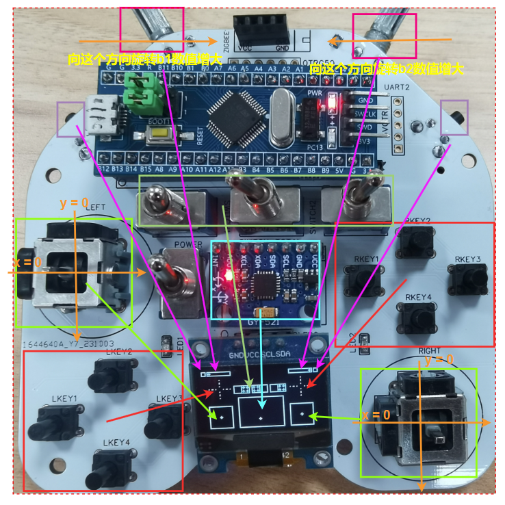

# 基于stm32f103c8t6最小系统板的手柄无线控制器/遥控器

## 摘要

> *请勿当真*

本控制器主要是给**以串口接受发送数据的无线模块**设计的一个硬件载体。由于串口收发无线模块(或串口透传)是比较常见的无线模块，如常见的蓝牙、zigbee、lora、wifi等无线模块，都支持通过串口来配置和发送数据，而为自己制作的小车、机械臂等加入无线控制功能也是很常见的设计方案。但是目前已有的项目中，制作难度、成本同功能性往往难以做到平衡(比如高集成度使用大量贴片时功能较丰富但可能焊接难度大；也有一些制作容易但是物理接口较少；此外存在部分项目PCB尺寸超出免费打样范畴，成本显著增加)。而本项目能在一定程度上填补此领域空白，使用大量直插元件能够显著降**低焊接难度**，并且控制PCB尺寸可以**免费打样**；在具有按键、旋钮、摇杆、位姿、开关等**丰富的输入接口**的同时也增加了锂电池充放电功能；最后，本项目能够在很大程度上复用常见的模块，能够进一步控制成本。因此本项目适用于多种**娱乐向/演示向场景**

*关键字： 串口透传、无线手柄、mpu6050、stm32、娱乐向*

## 简介

使用stm32f103c8t6作为主控的类似手柄造型的简易控制器，具有以下特点

- 拥有两个摇杆、8个正面按键、3个开关、2个顶部按键和两个顶部电位器的**物理输入能力**
- 具有一个mpu6050，可以支持简单的**位姿输入**
- 并且所有的输入都**实时可视化**在0.96寸的OLED上
- 适配使用串口通信的无线模组，并设计了常见的蓝牙和zigbee排母
- 适配了一个3.7v锂电池，可以**使用type-c充电**
- PCB使用嘉立创EDA绘制，并且尺寸**符合免费打样**的标准
- **大量使用了直插元件**，方便手工焊接
- 经过多次迭代打样实测，优化了前代不合理之处


### 演示




https://github.com/Staskaer/controller/assets/78833215/4ca1a1b4-529e-425c-b339-4db427694dbb


https://github.com/Staskaer/controller/assets/78833215/c7a27981-384b-4ca1-a509-df4dbefb6739


### 相关工作

> *文献查找不全，引用格式不当，务必忽略不严谨之处*

通过无线模块来进行远程控制一直都是一个比较常见的需求，而厂商为了用户使用更加方便，往往在自家产品上提供串口透传或类似的功能。如果追求易用和稳定往往可以使用ps2无线手柄进行控制。

针对DIY领域，手柄控制器的设计在航模领域非常常见，且具有一些相对成熟完善的开源项目(如[j20](https://github.com/J20RC/STM32_RC_Transmitter)、[loli](https://github.com/zhanglele666/loli3_RC)等知名项目)，这些项目非常完善，且维护者使用者非常多，是十分优秀的DIY设计，本项目也在一定程度上参考了其布局和元件的使用，并进一步优化了部分非航模场景下的元件使用情况。

而对于非航模领域，出现的控制器类型五花八门，比如[ESP32 万能遥控器](https://oshwhub.com/bukaiyuan/ESP32-hang-mu-yao-kong-qi)，外观和可用性非常好，但是制作成本和难度可能略高；而在[stm32蓝牙手柄](https://www.bilibili.com/video/BV1BT4y117QR/?spm_id_from=333.337.search-card.all.click&vd_source=0d656b14ae90f1922a53cbbeeb23cc68)中出现了通过双层PCB来模拟3D打印外壳的立体效果，不仅复用了每次打样的多余PCB板子，同时也避免了背部元件扎手的弊端，但仍有PCB较小、输入不够丰富的问题；还有一些设计是方形底板设计，如[无线迷你手柄](https://www.bilibili.com/video/BV1dp4y1H7h6/?spm_id_from=333.337.search-card.all.click&vd_source=0d656b14ae90f1922a53cbbeeb23cc68)，这种设计在握抓手感上存在一定的弊端，但是能够有效利用PCB面积。


## 使用说明

这里主要介绍一下本项目的一些使用说明，包括硬件下单指南、软件使用说明等等。

### 硬件下单指南

可以使用嘉立创直接下单，本项目使用嘉立创EDA完成绘制，且尺寸符合免费打样的标准。**PCB文件位于repo的PCB文件夹内。**

如何使用嘉立创直接下单，可以参考[这里](./docs/pcd_order.md)。

### 材料清单（购买指南）

这里主要介绍一下**PCB所使用到的元件**，以及一些购买指南。常见元件可以在某宝上直接购买，具体的型号参见[这里](./docs/bom.md)

### 硬件使用说明（重要！设计如何选购无线射频模块）

无线射频模块要求是可以**使用串口通信、发送数据**的，最少需要4个引脚，即vcc、gnd、rx、tx


其中顶部的4脚可以安装下图这种型号的zigbee模块


而中间的排母可以安装下图这种型号的蓝牙模块，其丝印"0TRG50"中的"0"表示一个引脚，T、R分别表示tx、rx，G表示gnd，5表示5v


而最后的排母则是一个通用的串口接口，可以安装任意的串口模块，其丝印"5VGTR"中的"5"表示5v，V、T、R分别表示3v3、tx、rx，G表示gnd

**可以通过自行使用洞洞板焊接转接板、打样时修改PCB等方式来适配自己的模块。**


### 软件使用说明（重要！涉及如何自定义发送数据）

**烧录：**

- **方法一**：在完成硬件的焊接后，打开本repo中的keil_project，并烧录到stm32f103c8t6上即可。
- **方法二（不推荐）**：将firmware文件夹中的hex文件烧录到stm32f103c8t6上，这种方法没办法完成对程序的修改，只能完成烧录。


在keil工程中，打开`user.c`文件，其中存在两个函数：

- `trans_init()`: 此函数会在程序启动时调用，可以通过串口初始化无线模块(如果有需要的话)，默认为空
- `trans_func(struct Data d)`: 此函数是完成发送功能的函数，当每一帧数据准备就绪后，会调用此函数来执行发送，用户通过自定义此函数可以完成无线控制功能。

下面给出简单的一个示例，并给出各个参数的含义（可见代码中注释）：

```c
// 此函数会在完成数据同步后调用，用于给串口发送数据
void trans_func(struct Data d)
{
	/*
	Data d中为当前状态的各个参数，修改此函数可以完成需要的数据的修改功能
	printf可以用于向串口发送数据
	
	其中Data中参数含义如下：
	
	**********************************************************************************************
	g_x1, g_y1 左摇杆的x、y数值，摇杆不动时为2048，最大值为4096，摇杆在最左端时g_x1=0 最上端时g_y1=0
	g_x2, g_y2 右摇杆的x、y数值，摇杆不动时为2048，最大值为4096，摇杆在最左端时g_x1=0 最上端时g_y1=0
	g_b1, g_b2 顶部电位器，b1为左侧，b2为右侧，电位器越向中间滑动数值越大，向两侧滑动数值越小
	
	
	**********************************************************************************************
	g_key_result 是一个16位的整型 每一位表示按键是否被按下，当按下时对应的位即为1，具体每一位含义如下
	第0至3位：表示右侧四个按键，0-3位分别是下右上左
	第4至7位：表示左侧四个按键，4-7位分别是下右上左
	第9位和第10位分别为左侧和右侧的顶部按键
	第11位为三个开关中右侧的那个开关的状态(开关位于左侧为0 位于右侧为1)
	第12位为三个开关中左侧的那个开关的状态(开关位于左侧为0 位于右侧为1)
	第13位为三个开关中中间的那个开关的状态(开关位于左侧为0 位于右侧为1)
	
	获取第i位可以使用 d.g_key_result &(0x1<<i)
	
	
	**********************************************************************************************
	g_pos_x, g_pos_y 表示一个位于屏幕中心的质点，将mpu6050两个轴的数据看作速度时的移动情况，可以用于表示mpu6050的累计作用效果
	其数值为浮点类型  pos_x的范围为[420,850] pos_y的范围为[320, 610]
	
	g_x, g_y 表示当前mpu6050的读数，浮点类型，角度x的范围为(-50, +50) 角度y的范围为(-80, +80)
	
	
	*/
	
	// 下面简单示例，当左摇杆在上、左、右时会对应发送 w a d
	if(d.g_y1<1000)
		printf("w");
	else if(d.g_x1<1000)
		printf("a");
	else if(d.g_x1>3900)
		printf("d");
}
```

另外，存在以下的宏可以用于LED显示，其中LED1和LED2仅在焊接上后才有效

```c
/*
另外，存在以下的宏可以用于LED显示，其中LED1和LED2仅在焊接上后才有效

*************板载LED控制*************

#define Board_LED_ON HAL_GPIO_WritePin(LED_GPIO_Port, LED_Pin, 1)
#define Board_LED_OFF HAL_GPIO_WritePin(LED_GPIO_Port, LED_Pin, 1)
#define Board_LED_Toggle HAL_GPIO_TogglePin(LED_GPIO_Port, LED_Pin)

*************LED1控制*************

#define LED1_ON HAL_GPIO_WritePin(LED1_GPIO_Port, LED1_Pin, 1)
#define LED1_OFF HAL_GPIO_WritePin(LED1_GPIO_Port, LED1_Pin, 0)
#define LED1_Toggle HAL_GPIO_TogglePin(LED1_GPIO_Port, LED1_Pin)

*************LED2控制*************

#define LED2_ON HAL_GPIO_WritePin(LED2_GPIO_Port, LED2_Pin, 1)
#define LED2_OFF HAL_GPIO_WritePin(LED2_GPIO_Port, LED2_Pin, 0)
#define LED2_Toggle HAL_GPIO_TogglePin(LED2_GPIO_Port, LED2_Pin)
*/
```

### 功能简介

- 具有8个正面按键输入，同时还有两个顶部侧键输入，屏幕实时显示按键状态
- 具有两个摇杆输入，摇杆不带按键功能，能够在方形区域内自由移动，屏幕实时显示摇杆位置
- 具有两个顶部电位器输入，电位器向中间移动时，对应的数值编码，屏幕实时显示电位器位置
- 具有三个开关，屏幕实时显示开关状态
- 具有一个mpu6050，除了能用于读取当前角度外，程序内置了一个质点，将mpu6050的读数转成成速度并积分，从而实现一个质点的位姿，屏幕实时显示质点位置
- 具有锂电池充电接口，使用type-c完成充电


## 程序详细介绍

使用cubemx+hal库的方式完成软件的编写，所有的引脚配置都在cubemx中完成，基本上用光了所有的引脚。

程序使用freertos，具有4个task，分别是`main_task`、`adc_task`、`key_task`和`iic_task`。其中`main_task`负责获取其他task的数据，并转发给用户定义的发送函数，`adc_task`负责获取adc的数据，`key_task`负责获取按键的数据，`iic_task`负责获取mpu6050的数据。

每个task内，获取的数据会优先显示在OLED上，并在锁的保护下完成数据的更新。

### 访问控制

程序的访问控制如下所示


### 程序流程图

程序内多个task的流程图如下所示


### 一些QA

> 1. 更改配置重新生成代码并烧录后为什么不工作？
> 
> 因为CUBEMX默认生成的代码有问题，需要在`main.c`中按照注释调整初始化顺序

> 2. 贴片电容、电阻、二极管可以不焊接嘛？
>
> 电容可以不焊接，仅作为滤波使用；电阻和二极管不焊接相当于少了两个反光器件，不影响主体使用

> 3. f103C8T6不是只有64KB嘛，为什么固件有100多KB了？
>
> 因为C8T6和CBT6基本上是一样的，使用后64KB可能会导致一些不稳定因素，但是作为toy级项目来说，应该不影响使用。可能会由于芯片体质不同导致一些不可预知的后果。

## 实验对比

暂略

## 结论

暂略

## 后续计划

- [ ] 目前pcb走线似乎存在一点问题，mpu6050似乎会不间断失效
