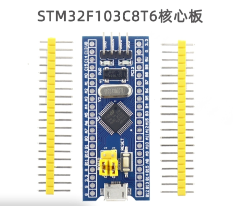
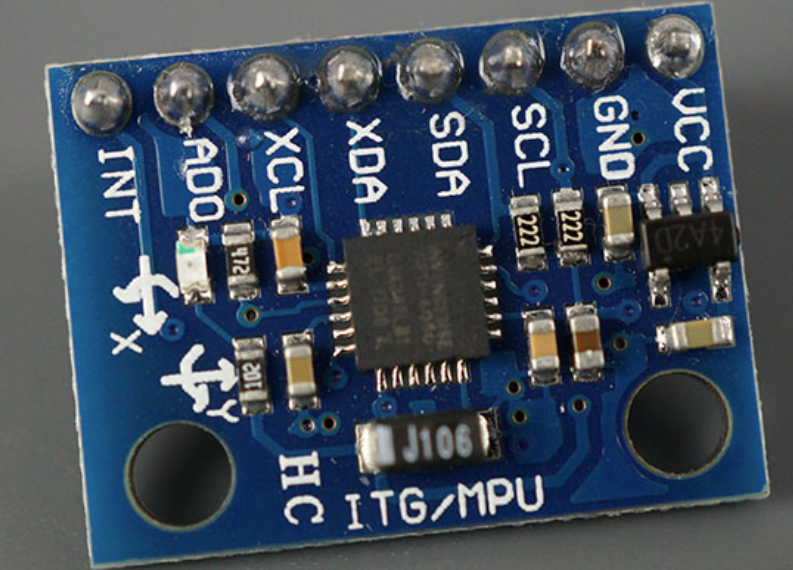
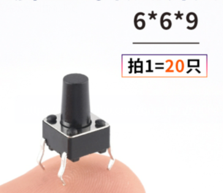
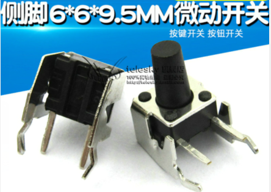
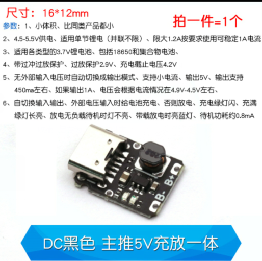
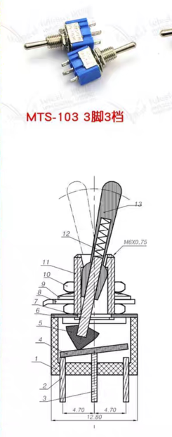
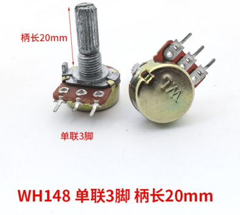
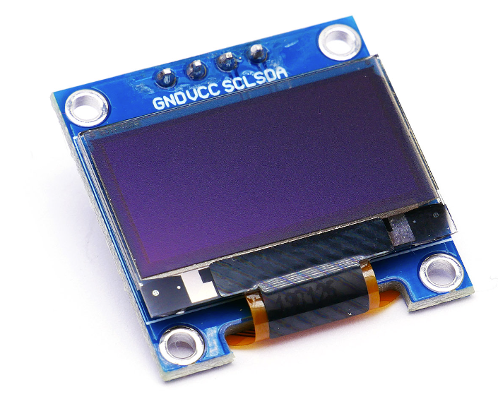
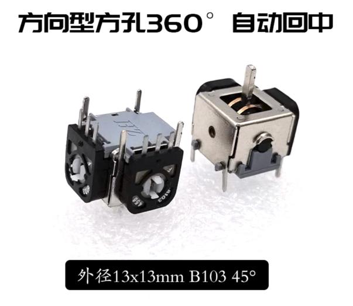
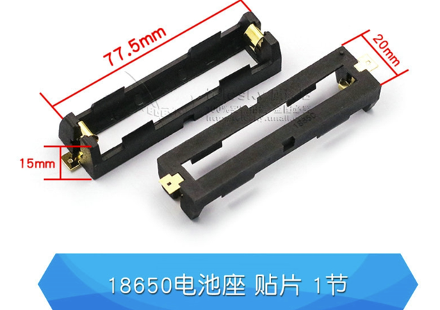

1. 主控：stm32f103c8t6最小系统板，最常见的蓝色板子即可

2. mpu6050: 使用常见的mpu6050模块即可，注意排针焊接方向

3. 6x6的按键：使用常见的按键即可，高度的话可以任意配置，比如买6x6x6或6x6x9的都可以，后者会高一点

4. 6x6顶部按键：建议买6x6x9.5的，这样凸起会大一点

5. 锂电池充放电模块：这里直接贴出当时购买的商品图

6. MTS-103开关：这个也没什么好说的，见图中尺寸

7. WH148顶部电位器：电位器阻值不要紧，10k、20k或者50k都可以，买了电位器后推荐顺便买一下电位器旋杆的帽子，可能会更美观一点

8. 0.96寸OLED：这里使用的是IIC接口的，新版或旧版的都可以安装，但推荐购买引脚序列为 gnd vcc scl sda 的模块

9. 摇杆：购买13*13的即可，建议买方型开口的，不带按键

10. 贴片锂电池座与锂电池：锂电池买3.7v的18650即可，电池座买贴片的型号

11. 螺丝、铜柱：螺丝买M3x5mm的就够了，需要8个；铜柱买双通M3x35mm的，需要4个

12. 排母：这里使用的是2.54mm的排母，建议购买20p、8p和4p的若干，这样控制器不用了后可以很方便的把模块拆下来

13. 贴片电阻、电容、发光二极管：这里使用的均是0805封装，电容为0.1uF，发光二极管颜色自选，电阻建议为400欧姆左右。(**实际上这些贴片元件不是必须的，不焊接也完全没问题**)
